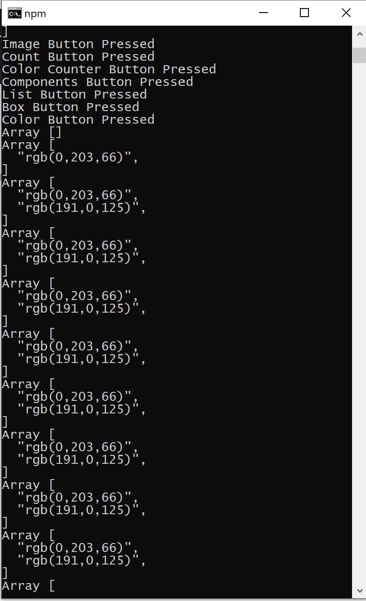
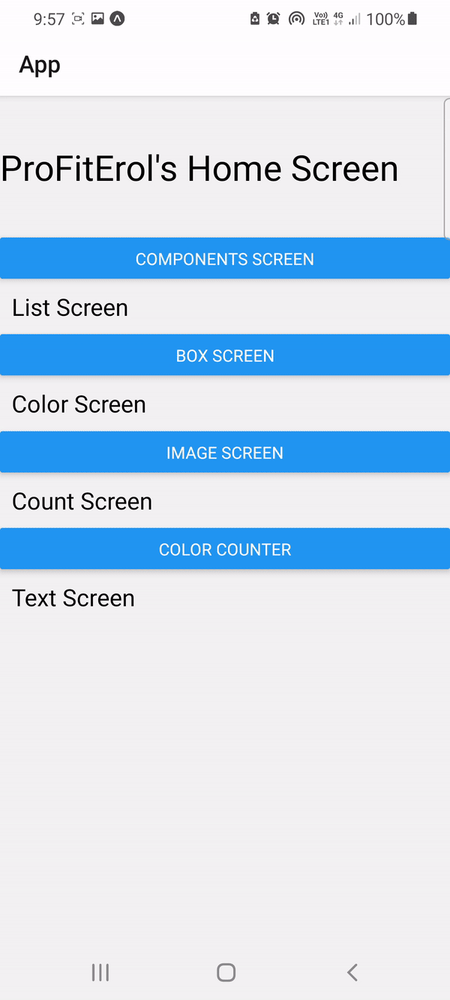

<!DOCTYPE html>
<html>
<body>

<h2>React Native Learning Materials in Apps </h2>

I know its bit Ugly look at the screenshot & the video but I have pull all my learning packages together 
put it under one roof. In this app you'll be playing showing: 
<lu>
	<li>Text</li>
	<li>Counters</li>
	<li>Colours</li>
	<li>Logins</li>
	<li>Fetchin Images</li>
	<li>Local Images</li>
	<li>Stacks</li>
	<li>List Views</li>
</lu>
 

    
    

</body>
</html>
