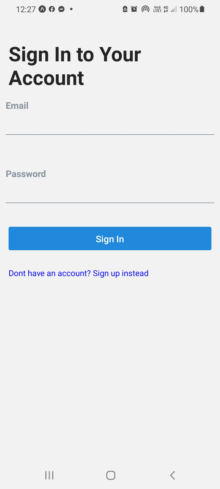

<!DOCTYPE html>
<html>
<body>

<h2>Tracking App</h2>

This project was literally was pain in the bamboo. Dealing with MangoDB and encrypting passwords 
all that cause me lot trouble and headache I'm quite glad that is over now. 
This tracker app contains: 

<lu>
	<li>Sing Up Page</li>
	<li>Login Page</li>
	<li>Databases</li>
	<li>Cryting passwords</li>
	<li>Ngrok</li>
	<li>Using Phone Stroge</li>
	<li>Location Permissions</li>
	<li>Saving Locations</li>
	<li>Sign out</li>
</lu>
 

    

</body>
</html>
